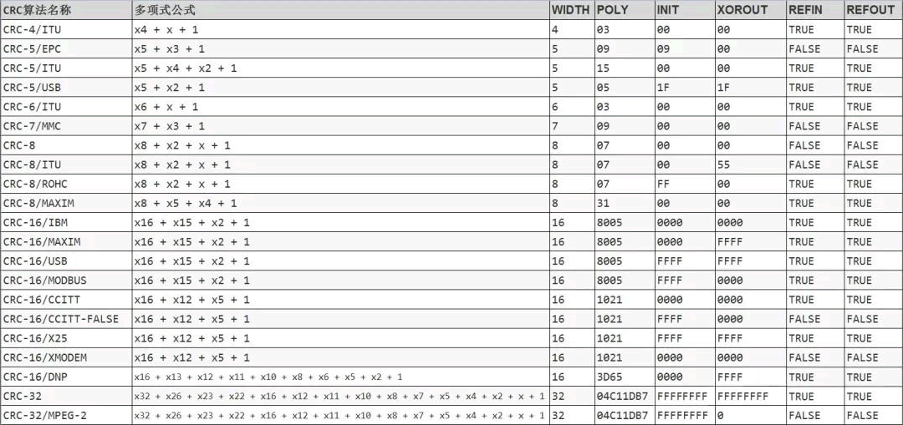
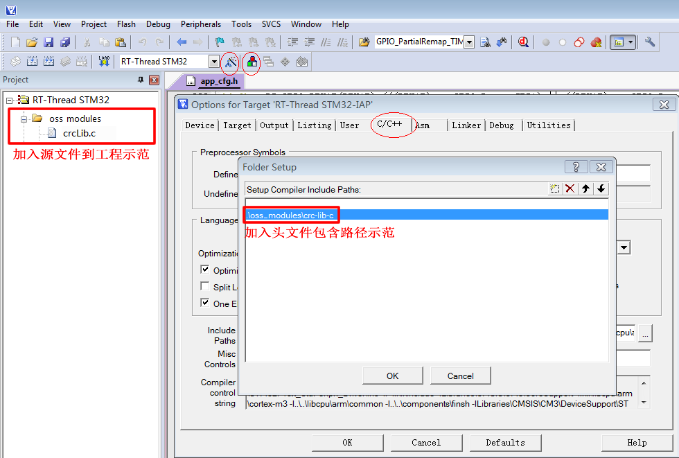

<!-- +++
author = "XT"
comments = false
date  = "2023-02-23"
draft = false
share = false
image = ""
menu  = ""
slug  = ""
title = "CRC 校验算法"
+++ -->

### 一、说明

<details close=""><summary>1、功能简介</summary>

* CRC 循环冗余校验（Cyclic Redundancy Check）是一种根据网络数据包或计算机文件等数据产生简短固定位数校验码的一种信道编码技术，主要用来检测或校验数据传输或者保存后可能出现的错误。它是利用除法及余数的原理来作错误侦测的。CRC 成为计算机信息通信领域最为普遍的校验方式。常见应用有以太网/USB通信，压缩解压，视频编码，图像存储，磁盘读写等。  
* CRC 所操作的原始数据以【大端】序列格式进行处理与传送，不过本 CRC 模块运算函数入口指向的原始数据指针是【单字节指针】，所以一般不需要理会大小端问题。  
* 特别说明：为什么 STM32 处理器的硬件 CRC 运算与本模块运算的结果不一样？因为 STM32 处理器为【小端】数据处理方式，CRC 规则要求为【大端】数据处理方式（标准的 CRC 函数的入口以及内部处理都是以**字节**作为基本处理单元，这样可以避免出现大小端格式问题，同时避免尾部 4 字节补齐填充问题）。  
* 本模块提供 21 个标准 CRC 参数模型。



</details>

<details close=""><summary>2、环境要求</summary>

|  环境  |  要求  |
| :----- | :----- |
| 软件环境 | 无特别要求 |
| 硬件环境 | 无特别要求 |
| 依赖环境 | 无特别要求 |

</details>

### 二、移植

<details close=""><summary>1、添加源文件</summary>

将模块源文件、文件包含路径添加到工程，示例：



</details>

<details close=""><summary>2、包含头文件</summary>

在使用模块的应用程序中加入头文件包含，示例：  

```c
#include "crcLib.h"
```

</details>

### 三、使用

<details close=""><summary>1、应用示例</summary>

```c
#include "crcLib.h"

uint8_t  buf[] = {0x1, 2, 3, 4, 5, 0x67, 8, 9, 0x10, 0xAB, 0xCD, 0xEF}; //要计算的数据
uint32_t crc; //计算结果缓存

crc = crc32((uint8_t *)buf, sizeof(buf)); //计算出CRC32结果（其它CRC函数使用方法一样的）

```

</details>