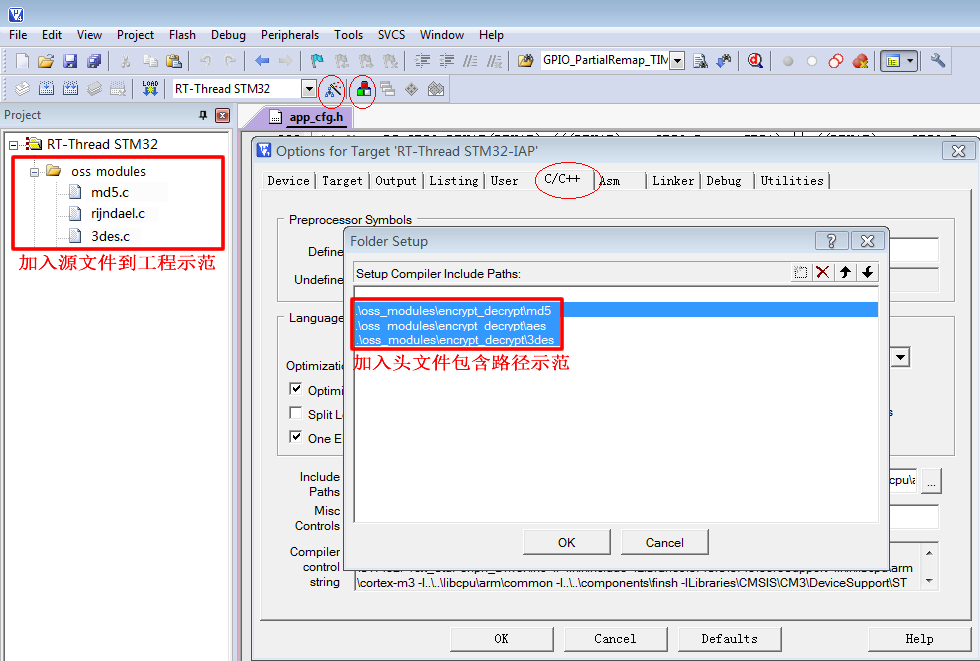

<!-- +++
author = "XT"
comments = false
date  = "2023-02-24"
draft = false
share = false
image = ""
menu  = ""
slug  = ""
title = "MD5、AES、DES 摘要/加密算法"
+++ -->

### 一、说明

<details close=""><summary>1、功能简介</summary>

* MD5　不可逆过程的摘要算法，结果是 128位【16字节】，主要用途有：验证消息完整性，安全访问认证，数据签名。
* AES　新一代的对称加密算法，密钥长度可以选择 128位【16字节】，192位【24字节】和 256位【32字节】密钥。
* DES　比较老的对称加密算法，密钥长度是 56位【7字节】。一共有三个参数入口：原文，密钥，加密模式。
* 3DES 比较老的对称加密算法，加长了密钥长度，可以为 112位【14字节】 或 168位【21字节】。
* RSA　非对称加密。

常用加密解密算法介绍和使用：【[网文](https://blog.csdn.net/lgxzzz/article/details/124896121)】  
本模块中的 MD5 原作者可能是：【[仓库](https://github.com/talent518/md5)】  
本模块中的 AES 原作者可能是：【[仓库](https://github.com/matt-wu/AES)】  

</details>

<details close=""><summary>2、环境要求</summary>

|  环境  |  要求  |
| :----- | :----- |
| 软件环境 | 无特别要求 |
| 硬件环境 | 有一定要求 |
| 依赖环境 | 无特别要求 |

</details>

### 二、移植

<details close=""><summary>1、添加源文件</summary>

将模块源文件、文件包含路径添加到工程，示例：



</details>

<details close=""><summary>2、包含头文件</summary>

在使用模块的应用程序中加入头文件包含，示例：  

```c
#include "md5.h"
#include "rijndael.h"
#include "3des.h"
```

</details>

### 三、使用

<details close=""><summary>1、MD5 应用示例</summary>

```c
#include "md5.h"

MD5_CTX md5; //MD5对象
unsigned char datasrc[13] = {12, 222, 11, 83, 4, 5, 189, 21, 48}; //要运算的数据
unsigned char decrypt[16]; //结果寄存器

//每次运算 MD5 码，必须依次调用 3 个函数进行操作
MD5Init(&md5);                             //初始化
MD5Update(&md5, datasrc, sizeof(datasrc)); //导入数据（此处可以多次导入多段数据）
MD5Final(&md5, decrypt);                   //计算并输出 16 字节 MD5 到 decrypt[]

```

</details>