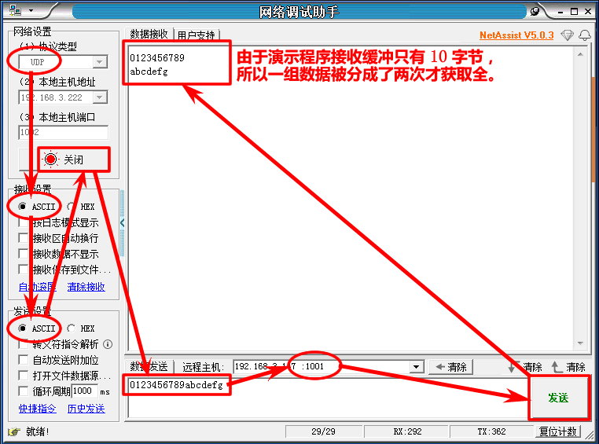
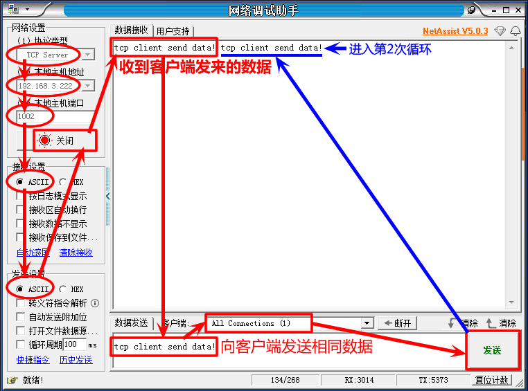

<!-- +++
author = "XT"
comments = false
date  = "2022-12-10"
draft = false
share = false
image = ""
menu  = ""
slug  = ""
title = "网络服务模块演示"
+++ -->

### 简介

使用【xt_wiznet】网络服务模块，演示 UDP 接收与返回(发送)，演示 TCP 客户端的发送与接收。  

### 演示

1、在 "application.h" 头文件加入下面宏定义，开启网络服务模块演示，并且重新编译程序。  

```c
#define XT_APP_DEBUG                    20221210                        /* 开启演示                     */

#define __XT_WIZNET_REMAP_H
#define __XT_WIZNET_PORT_REMAP_H
#ifndef XT_APP_WIZNET_EN
#define XT_APP_WIZNET_EN                XT_DEF_ENABLED                  /* 网络服务模块                 */
#endif
```  

2、下载运行程序，使用网络调试助手进行测试 UDP，程序端收到什么数据就返回什么数据，如下图（备注：UDP 本地端口为`1001`）：



3、下载运行程序，使用网络调试助手进行测试 TCP，服务端收到什么数据就发送什么数据，如下图（备注：TCP 连接的服务端 IP 为`192.168.3.222`，端口为`1002`）：


